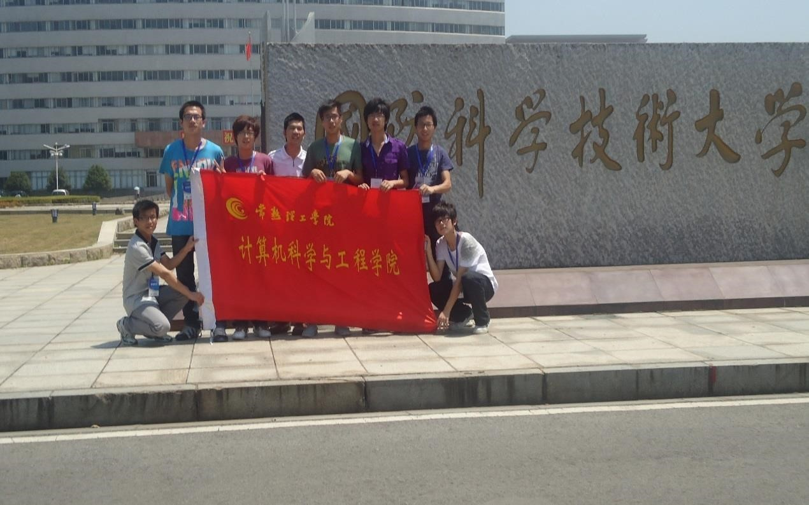
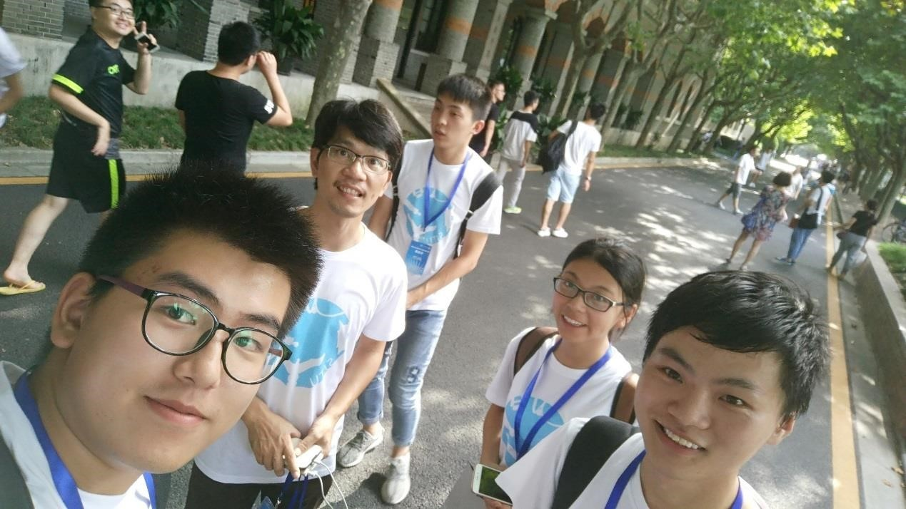

# 社团介绍

下一代互联网技术实验室（**Next Generation Internet Lab，NGIL**）成立于 2009
年，成立以来一直致力于网络、软件和信息安全技术的开发及人才培养，实验室
为感兴趣的同学提供良好的学习环境、制定合适的学习内容和计划、引导学生挖
掘自己的特长和潜能。参加实验室的同学将根据自己的兴趣和特长在导师和学长
的指导下，参加各种创新实践和学科竞赛，不仅拓宽同学们的眼界，丰富自己的
大学生活、还能大大提升自己的专业技能，为日后的考研和工作打下良好的基础。

# 兴趣方向

- 软件开发：C/C++；汇编、Java；PHP；Python 等；
- 网络安全：物联网安全；网络渗透；数据加密；软件加固；代码混淆等；
- 新型网络：新型物联网；虚拟网络；云计算网络；
- 大数据：人工智能；机器学习等；

# 社团实况

1. 认真训练

   

2. 爱常熟，爱理工！

   

3. 轻松一刻

   

4. We Are Team!

   

5. We Are Family!

   
