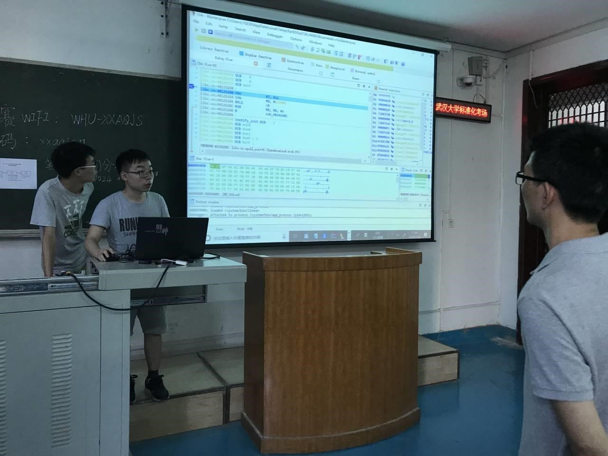
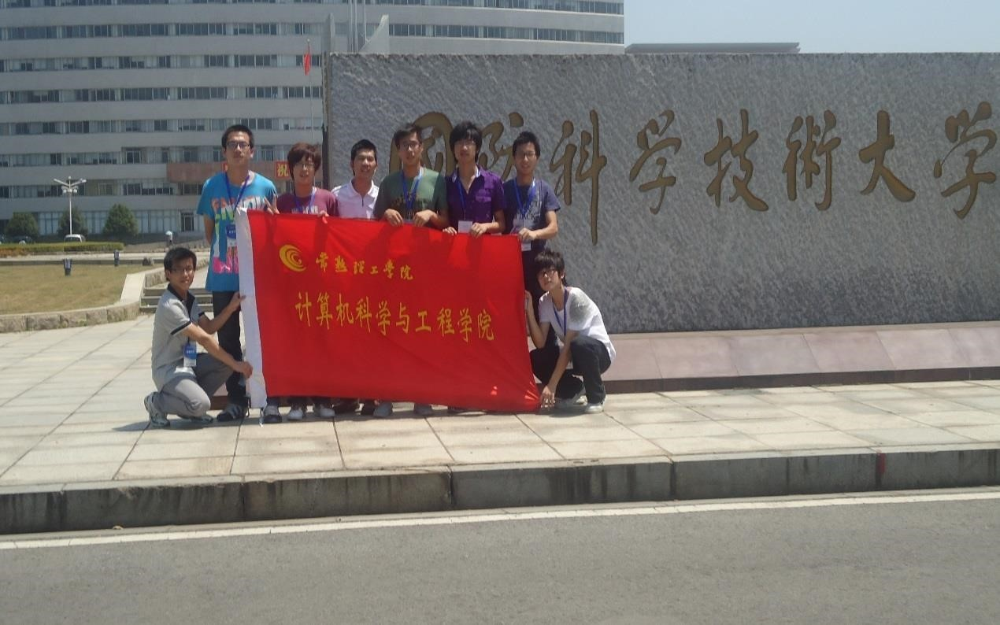
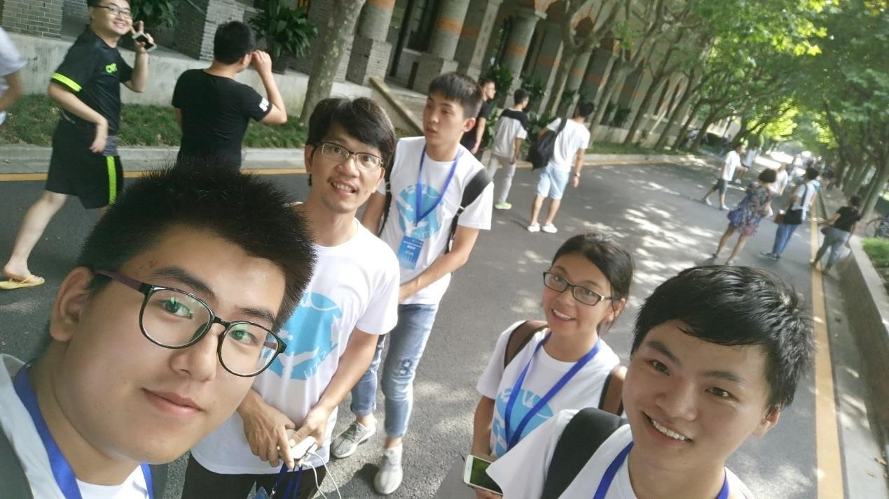
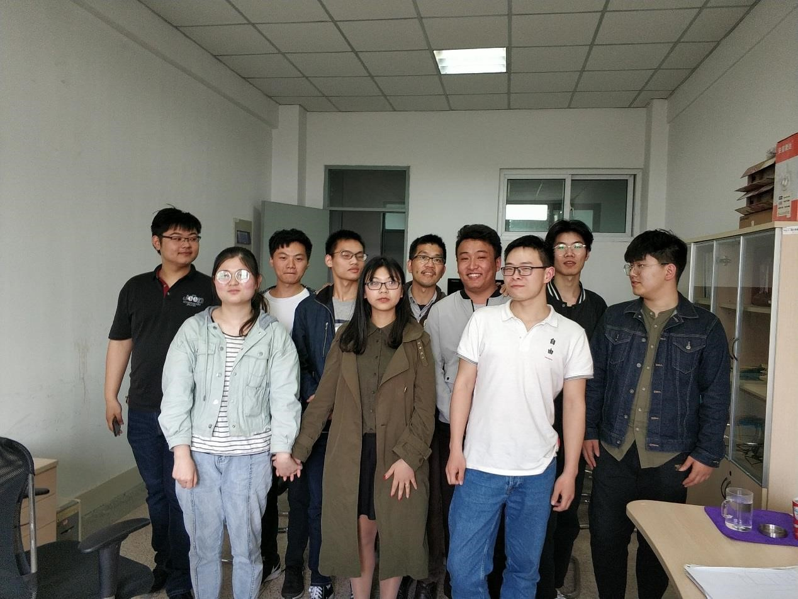
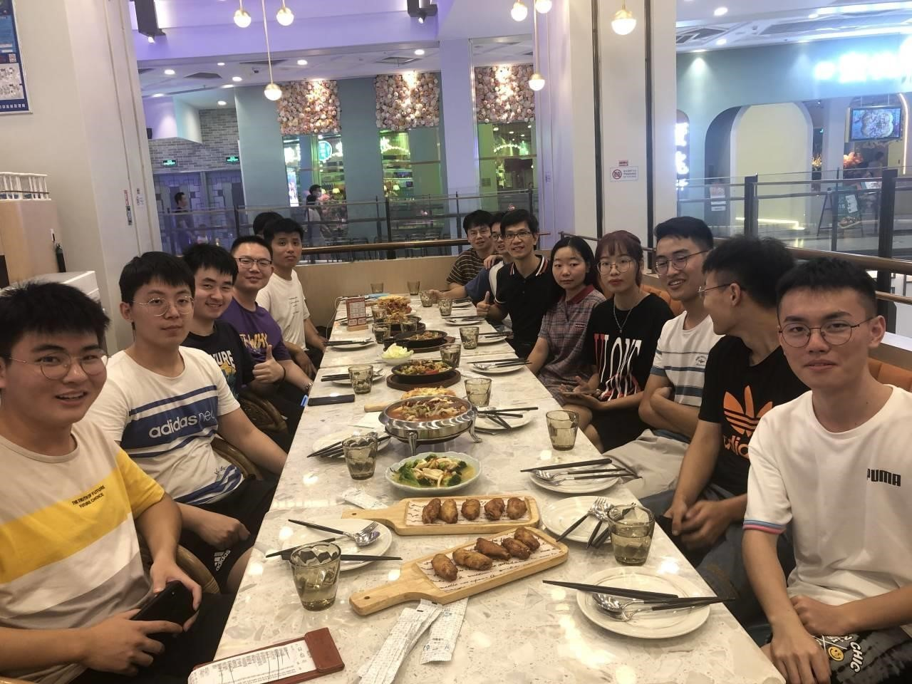

# 实验室介绍

## 介绍

下一代互联网技术实验室（**Next Generation Internet Lab，NGIL**）成立于 2009
年，成立以来一直致力于网络、软件和信息安全技术的开发及人才培养，实验室
为感兴趣的同学提供良好的学习环境、制定合适的学习内容和计划、引导学生挖
掘自己的特长和潜能。参加实验室的同学将根据自己的兴趣和特长在导师和学长
的指导下，参加各种创新实践和学科竞赛，不仅拓宽同学们的眼界，丰富自己的
大学生活、还能大大提升自己的专业技能，为日后的考研和工作打下良好的基础。

## 兴趣方向

- 软件开发：C/C++；汇编、Java；PHP；Python 等；
- 前端：HTML, CSS, JavaScript, TypeScript, Vue, React 等；
- 网络安全：物联网安全；网络渗透；数据加密；软件加固；代码混淆等；
- 新型网络：新型物联网；虚拟网络；云计算网络；
- 大数据：人工智能；机器学习等；

## 指导老师

乐德广。2004 年赴德国哥廷根大学访问工作，期间主要从事有关信息安全方面的研究工作，并在现有研究方向研究范围的基础上，不断扩展与之相关的研究范围，加深研究空间。2006 年获厦门大学博士学位。先后参与完成欧盟国际合作项目、国家自然基金、江苏省科技项目以及企业横向合作课题等多项。曾在国内外学术刊物或会议上发表学术论文 20 多篇，已有 12 篇被 SCI、EI、ISTP 等科技索引摘入；出版教材 1 部；获得授权发明专利 3 项目；获得软件著作权 9 项。

## 实验室实况

1. 认真训练

   

2. 爱常熟，爱理工！

   

3. 轻松一刻

   

4. We Are Team!

   

5. We Are Family!

   
